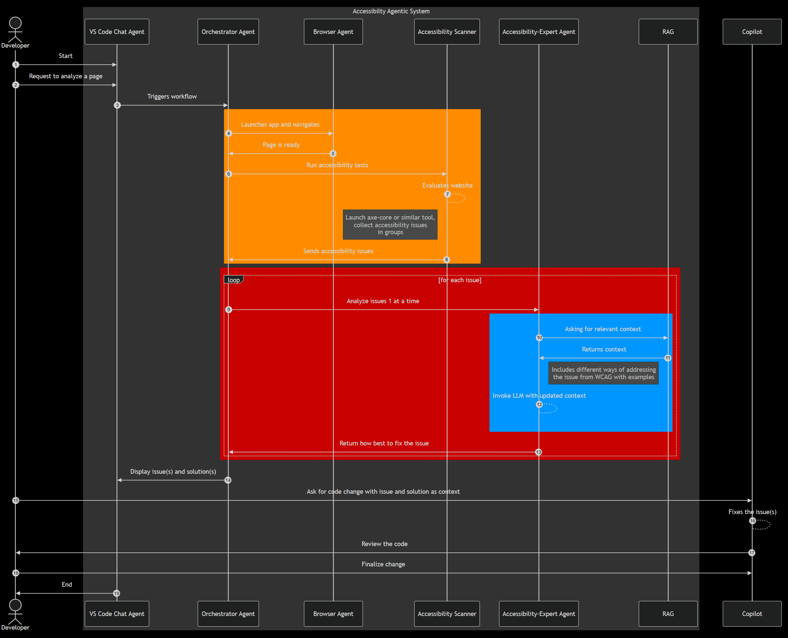

# AxessAI

AxessAI is an AI-powered accessibility assistant integrated with Visual Studio Code. It helps developers identify and resolve accessibility issues in web applications by leveraging automated testing tools and a retrieval-augmented generation (RAG) model trained on WCAG 2.0 and MDN documentation.

## 🚀 Project Overview

AxessAI is built in three stages:

1. **Chatbot with RAG**: A chatbot integrated into VS Code that receives accessibility issue reports (from the Axe Developer Tool) and provides multiple solutions with examples.
2. **Automated Accessibility Scanning**: A browser agent automatically invokes the Axe tool, captures results, and forwards them to the chatbot.
3. **Orchestrator Agent**: A controller that takes user input for accessibility testing, navigates the page using the browser agent, collects accessibility issues, and queries AxessAI for solutions.

## 🏗️ Architecture

AxessAI follows a structured workflow for accessibility analysis:

1. **VS Code Chat Agent**: Developer initiates a request to analyze a page.
2. **Orchestrator Agent**: Triggers workflow and communicates with the browser agent.
3. **Browser Agent**:
   - Launches the application and navigates to the specified page.
   - Runs accessibility tests using `axe-core` or similar tools.
   - Collects accessibility issues in groups and sends them to the **Accessibility Scanner**.
4. **Accessibility Scanner**: Evaluates the website, processes the accessibility issues, and sends them for further analysis.
5. **Accessibility-Expert Agent**:
   - Iterates over each accessibility issue.
   - Queries the **RAG system** (Pinecone as vector store, LangChain, and DSPy) for relevant WCAG 2.0 and MDN-based context.
   - Returns solutions with multiple approaches to address each issue.
   - Passes the issue and context to an **LLM** for refined suggestions.
6. **VS Code Chat Agent**: Displays issue(s) and corresponding solutions to the developer.
7. **Copilot Integration**:
   - Developers can request code changes based on the issue and solutions provided.
   - The code is reviewed, finalized, and applied.
8. **Completion**: The issue is resolved, and the process ends.

## 📊 Workflow Diagram



## 🛠️ Tech Stack

- **Programming Languages**: Python, TypeScript
- **Frameworks & Libraries**:
  - **AI & LLM**: DSPy, LangChain
  - **Vector Database**: Pinecone
  - **UI**: Streamlit
- **Tools**:
  - **Accessibility Testing**: Axe Developer Tools
  - **Version Control & Deployment**: GitHub Actions

## ⚙️ Installation & Setup

### Prerequisites

- [Node.js](https://nodejs.org/) (for VS Code extension development)
- [Python](https://www.python.org/) (for AI inference locally)
- Pinecone API key for vector storage

### Installation Steps

```sh
# Clone the repository
git clone https://github.com/your-org/axessai.git
cd axessai

# Install dependencies, setup and activate virtual environment
./setup.bat
./venv/Scripts/activate

# Check if the virtual environment is activated
if ($env:VIRTUAL_ENV) { "Virtual environment is active" } else { "Virtual environment is not active" }

# Run accessibility agent
python run_agent.py --query "How to make images accessible?"

# Run retriever
python run_indexer_rag.py --mode "query" --query "How to make images accessible?"

# Run indexer
python run_indexer_rag.py --mode "index" --file "test.txt"

# Run api
python -m src.api.main # Open http://localhost:8000/health to check if the api is up http://localhost:8000/docs to see documentation

# Observability
mlflow ui --backend-store-uri sqlite:///mlflow.db  # open http://127.0.0.1:5000 to view trace and matrices

# Checking Axe Errors for a URL directly
python -m src.tools.axe_core_scanner https://example.com
```

## 📜 Usage

1. Open VS Code and open CoPilot Chat. Type in @axessAI to interact with the agent
2. Currently it can support below flags.  
   1./scan [url] (Performs accessibility scanning on the supplied url and formatted issues are returned.)  
   2./fix [issue number] (analyses specific issue and returns steps to resolve with examples)  
   3./query [question] (default) (answers any accessibility specific query)
3. Review multiple suggested fixes and code snippets.
4. Apply fixes directly in your codebase.
5. Optionally, request AI-generated code changes via Copilot integration.

## 📖 Roadmap

- [ ] Improve AI response accuracy with fine-tuned WCAG 2.2 knowledge.
- [ ] Support for additional accessibility tools (e.g., Lighthouse).
- [ ] Integrate with CI/CD pipelines for automated accessibility checks.
- [ ] Enhance reporting and issue tracking.

## 🤝 Contributing

Contributions are welcome! Please follow these steps:

```sh
# Fork the repository
# Create a new branch
git checkout -b feature-xyz

# Commit your changes
git commit -m "Your description"

# Submit a pull request
git push origin feature-xyz
```

## 📞 Contact

For questions or feedback, contact DevOn Software Services Pvt Ltd
